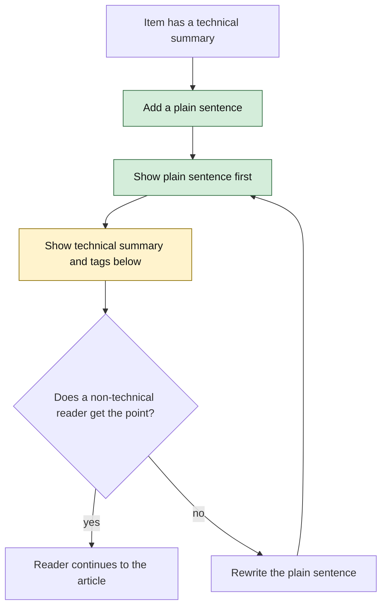
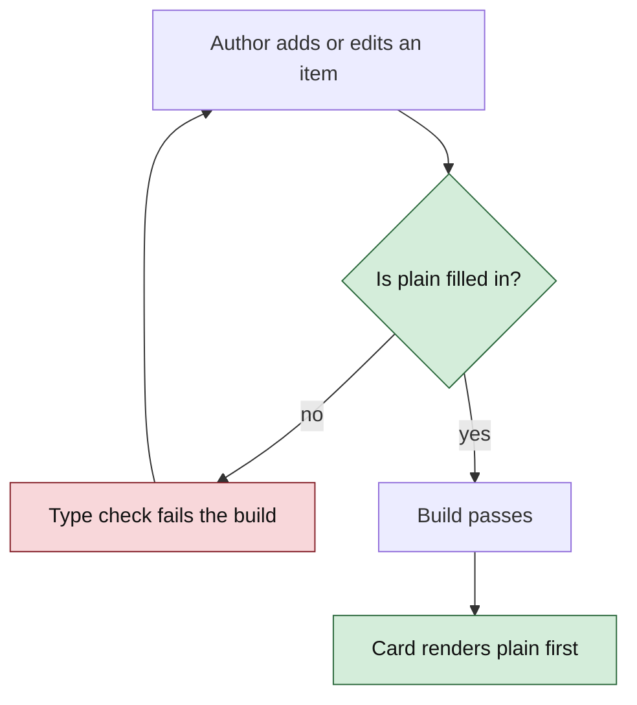
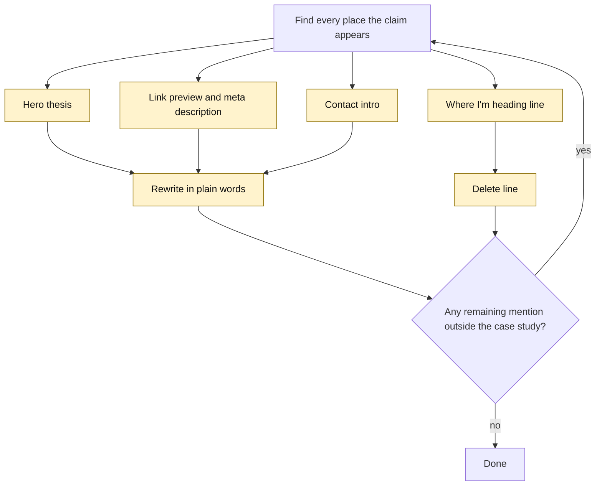
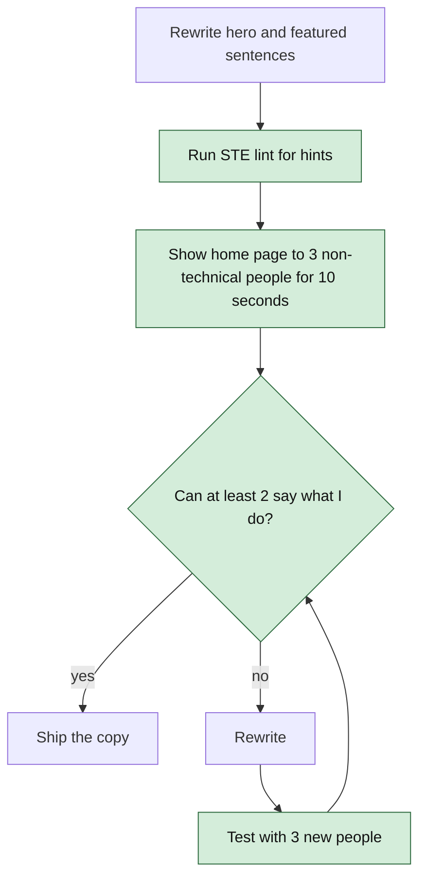

# Architecture Decision Record

## ADR-001: Curated index instead of single-page resume

**Status:** Accepted

**Decision:** Make the homepage a small editorial index and move depth into routed detail pages.

**Why:** The current page demonstrates breadth but forces every audience through the same long sequence. Separate pages allow recruiters to scan and technical readers to inspect evidence.

**Trade-off:** More routes and content maintenance, but clearer hierarchy and stronger shareable URLs.

## ADR-002: Meaningful activity ledger instead of contribution heatmap

**Status:** Accepted

**Decision:** Display dated public outputs and milestones. Do not display raw commit totals or a cloned GitHub heatmap in the first release.

**Why:** Commit frequency measures repository activity, not research or engineering value. A curated ledger can explain what changed and link to the artifact.

**Trade-off:** Updates are initially manual. This is intentional: editorial judgment is part of the signal.

## ADR-003: Local typed content as source of truth

**Status:** Accepted

**Decision:** Store work, publications, and activity as typed TypeScript records in the repository.

**Why:** The site is currently a static Vite application. Local typed content preserves simple deployment, version history, and compile-time validation without introducing a CMS or database.

**Trade-off:** Publishing requires a code change. A CMS can be reconsidered after publishing frequency proves the need.

## ADR-004: Honest publication taxonomy

**Status:** Accepted

**Decision:** Separate `writing`, `note`, `research`, `reproduction`, and `paper`, and attach explicit statuses such as `draft`, `published`, `submitted`, `under-review`, or `accepted`.

**Why:** A technical note is useful evidence but must not be presented as peer-reviewed research.

**Trade-off:** More metadata and stricter wording, with materially higher credibility.

## ADR-005: Evolve, do not clone, the reference design

**Status:** Accepted

**Decision:** Borrow the reference site's calm navigation and public-work hierarchy without reproducing its visual identity.

**Why:** Saketh's strongest differentiation is production AI systems moving toward industrial machines and compute. The design should express that specific story.

**Trade-off:** Less immediately flashy than the current hero, but more distinctive and readable.

## ADR-006: Build-time or manual GitHub integration only

**Status:** Accepted

**Decision:** Do not call GitHub APIs from the browser for the initial version. Public GitHub releases may later be ingested during the build and converted into reviewed activity records.

**Why:** Client-side API calls add loading states, rate-limit failure, and uncurated noise.

**Trade-off:** No automatic real-time activity initially.

## ADR-007: Hash routing remains for the first redesign

**Status:** Accepted

**Decision:** Keep the existing `HashRouter` during the first implementation unless the deployment target is changed and configured for SPA rewrites.

**Why:** This minimizes deployment risk while enabling detail pages.

**Trade-off:** URLs contain `#`. Clean URLs can be a later deployment decision.

## ADR-008: Full experience chronology gets its own route

**Status:** Accepted

**Decision:** Add `/#/experience` for the complete reverse-chronological work history. The homepage contains only a compact preview and a resume action.

**Why:** Recruiters need the chronology, but placing every bullet on the homepage would recreate the long-resume problem the redesign is solving.

**Trade-off:** One additional click for complete detail, in exchange for a much faster homepage scan.

## ADR-009: LinkedIn establishes chronology; the approved resume establishes technical emphasis

**Status:** Accepted

**Decision:** Use the supplied LinkedIn screenshots for company, title, employment type, dates, location, and ordering. Use the approved resume for the tighter J&J, HP, and ECrent achievement bullets. Feature only the résumé roles (J&J, HP, ECrent) in the timeline. List every role, including iDwTeam and ASU, as one-line rows in a "Full history" section at the bottom, like LinkedIn. Given up: iDwTeam and ASU get no summary or bullets on the portfolio, and the page carries two views of the same roles.

**Why:** LinkedIn is the complete employment ledger, while the resume contains stronger recruiter-facing technical framing. Combining them prevents both missing roles and bloated copy.

**Trade-off:** The site intentionally does not reproduce every LinkedIn bullet verbatim.

## ADR-010: Neural animation is progressive enhancement

**Status:** Accepted

**Decision:** Represent the chronology as connected neural nodes with a subtle signal animation, ordered newest to oldest. Content remains ordinary semantic HTML and fully visible without JavaScript animation.

**Why:** The visual metaphor supports the AI-systems identity while chronology—not spectacle—remains the primary information.

**Trade-off:** Requires careful mobile and reduced-motion testing.

## ADR-011: Resume is a first-class recruiter action

**Status:** Accepted

**Decision:** Keep one canonical PDF in `public/`, label the action `Download resume`, and expose it from the hero, Experience route, and footer.

**Why:** Recruiters should not need to search the site or copy experience manually.

**Trade-off:** The checked-in PDF must be refreshed whenever the approved resume baseline changes.

## ADR-012: Contact returns as the homepage's closing section, not a route

**Status:** Proposed

**Decision:** Add a contact section as the final block of the homepage, after the activity ledger. Do not add a `/#/contact` route, and do not add `Contact` to the primary navigation.

**Why:** ADR-001 made the homepage a curated index that a recruiter reads top to bottom in about thirty seconds. A narrative that ends on a list of recent activity ends on an observation; ending it on a contact block ends it on an action, at exactly the point where a convinced reader is looking for one. A dedicated route would put a click between that moment and the address, and would spend one of six navigation slots on a section containing four links — slots currently held by Work, Experience, Writing, Research, and Notes, all of which hold substantially more.

The information architecture in `architecture.md` has listed `Contact / resume` as the last homepage node since before the redesign. This restores what was already specified rather than introducing a new idea.

**Trade-off:** There is no shareable contact URL, and the section is reachable only by scrolling the homepage or by using the footer's icons. If the site later grows a "work with me" or availability page with real content, that becomes a route and this ADR gets superseded.

## ADR-013: The email address is page text; `mailto:` is an enhancement on top of it

**Status:** Proposed

**Decision:** Render `sakethv7@gmail.com` as visible text. Wrap it in a `mailto:` link and add a copy-to-clipboard control beside it. Never rely on the `mailto:` alone to communicate the address.

**Why:** A `mailto:` link is a request that the operating system open a registered mail handler. When none is registered — a browser-only mail setup, a locked-down corporate machine — the click does nothing and reports nothing. No error, no navigation, no console output. This is the current bug: the site's single most important action fails silently and undetectably, and it fails for exactly the audience most likely to be on a managed laptop.

Making the address readable text removes the dependency. The worst outcome becomes a visitor reading eleven characters and typing them elsewhere, which always works. The `mailto:` still serves everyone whose machine handles it, and the copy button serves the middle case where a visitor wants the address in a different tool.

The clipboard write itself uses the async Clipboard API, which requires a secure context and can be denied. That failure must be visible — the address stays on screen regardless, so a denied copy degrades to the always-works path rather than to nothing.

**Trade-off:** A plaintext address on a public page is harvestable by scrapers, so this accepts some spam risk in exchange for the contact path actually working. Obfuscation schemes that defeat scrapers also defeat screen readers and copy-paste, which costs more than the spam does. The section also gains a small amount of client state and an interaction to test, where a plain link had none.

## ADR-014: Every URL pointing at this site is router-aware or base-path-composed

**Status:** Proposed

**Decision:** Replace the not-found page's raw `href="/"` with router navigation, add a base-path-composed favicon link, and add `og:image` and `og:url` built from the deployed origin. Prohibit raw absolute paths that point back at this site.

**Why:** The site is served from `/sakethai-portfoliogen/`, not from the domain root. A path written as `/` or `/favicon.ico` resolves correctly in local development, where the Vite base is `/`, and incorrectly in production, where it escapes to the domain root. The bug class is invisible to the build, to TypeScript, and to local testing — it appears only after deploy, which is where it is most expensive to notice.

Three instances exist today. The not-found page's home link leaves the site. The missing favicon link causes the browser to probe the domain root and get nothing, so the deployed `public/favicon.ico` is never requested. And `twitter:card` is declared as `summary_large_image` with no image to display, so every shared link renders an empty card — the portfolio's primary distribution channel is a pasted URL, which makes this the most visible of the three.

The not-found page is also restyled into `PortfolioShell`. It currently ships Tailwind's `bg-gray-100` against a near-white `--foreground`, which renders its `404` heading invisible against its own background.

**Trade-off:** `og:image` requires producing and maintaining a social card image, which is a design asset that did not previously exist and that goes stale when the positioning copy changes. `og:url` must be hardcoded to the deployed origin because static HTML cannot compose it at request time, so it needs a manual edit if the site ever moves to a custom domain.

## ADR-015: "Stunning" comes from composition and type, not effects

**Status:** Proposed. Amends the *Visual system* section of `architecture.md`; does not supersede ADR-005.

**Context:** The goal is to move the site from "decent" to "memorable". There are two ways to get there. *Effect-led* design adds visual events: WebGL or particle heroes, glassmorphism, parallax, scroll-jacking. *Composition-led* design changes structure: tile hierarchy, a real display typeface, a disciplined scale, and one signature interaction. The pre-redesign site was effect-led, and ADR-005 removed it on purpose.

**Options:**

1. Effect-led redesign. High initial impact. Conflicts with ADR-005 and ADR-010, and costs 50–200 kB of JS plus ongoing GPU work.
2. Composition-led upgrade (bento fold, tokens, spotlight, restrained motion).
3. Typography and spacing polish only. The cheapest option, but it leaves the fold without evidence.

**Choice:** Option 2.

**Why:** The audience is recruiters and engineers. For them, the memorable moment is seeing real evidence (140k users, current role, flagship systems) arranged with obvious care in the first viewport. Effects are memorable once and then get in the way of reading. Composition also scales down to mobile, where most effect-led heroes collapse into a slow blank screen.

**Given up:** The "wow in the first 500 ms" that a motion-heavy hero gives. Visitors who judge by spectacle will find this quieter than template portfolios. It also closes off the WebGL/3D direction unless a later ADR reopens it.

## ADR-016: CSS-first motion; no Framer Motion or GSAP

**Status:** Proposed

**Context:** The requested micro-interactions are staggered entrance, scroll reveal, hover spotlight, and arrow nudges. The candidates are Framer Motion (now `motion`), GSAP with ScrollTrigger, or plain CSS plus one small hook.

**Options:**

| Option | Approx. cost (gzip) | Gives you |
|---|---|---|
| `motion` with `LazyMotion` + `domAnimation` | ~15–20 kB | Springs, exit animations, layout/shared-element transitions |
| GSAP core + ScrollTrigger | ~35 kB | Timelines, precise scroll scrubbing, pinning |
| CSS keyframes + `animation-timeline: view()` + one pointer hook | ~0.5 kB | Everything in the proposed motion table |

**Choice:** CSS, plus one ~15-line `useSpotlight` hook.

**Why:** Nothing in the proposed motion needs springs, exit choreography, or timeline scrubbing. Those are the features that justify a library. CSS also inherits `prefers-reduced-motion` handling from one media query, where a library needs it wired into every call. Size figures are approximate and should be re-measured if this is reconsidered.

**Given up:** Spring physics, which feels more "alive" than easing curves. Layout animations, e.g. a bento tile expanding into a detail page. Route exit animations. Scroll reveal in browsers without scroll-driven animation support: in Firefox, check support at implementation time. Those visitors see content with no reveal. That is the correct fallback, but they get a flatter experience. If detail pages later want tile-to-page morphing, adopt `motion` then, in a new ADR.

## ADR-017: The bento grid consolidates existing homepage blocks; it adds no content

**Status:** Proposed

**Context:** The homepage content budget in `architecture.md` limits the hero, selected work, and experience preview. A bento grid tempts you to fill tiles with filler: skills clouds, GitHub stats, tech logos.

**Choice:** The bento replaces the hero, the experience preview, and the featured-work grid. Every tile renders a record that already exists in `src/data/`. The one numeric tile uses the resume-backed "~140,000 internal users" figure and labels it approximate. Tiles are placed with `grid-template-areas`, and the DOM order is the reading order.

**Why:** It keeps ADR-001 and ADR-004 intact. The layout changes; the honesty rules don't. Tying tiles to data records also means a new flagship project changes the fold without layout code changes.

**Given up:** The generous editorial whitespace of the current hero. The name gets a smaller cell than the full-width `h1` it has now. Also, the fold is denser, which some readers find busier.

## ADR-018: Design tokens as CSS custom properties

**Status:** Proposed

**Context:** `index.css` has 30+ font sizes and 20+ spacing values with no system. Tailwind's theme is configured, but the live pages use none of its utilities.

**Options:** (1) Move the styling to Tailwind utilities and use its theme scale. (2) Keep the hand-written CSS and add a token layer of CSS custom properties.

**Choice:** Option 2. A type scale (ratio ≈ 1.25, 8 steps with `clamp()` on the top three), an 8-point spacing scale (4 → 128 px), radius and motion tokens in `src/styles/tokens.css`.

**Why:** Rewriting 190 lines of working semantic CSS into utility classes is a large, low-value diff. Tokens give the consistency benefit without changing the authoring model. Custom properties can also be read and animated at runtime, which the spotlight needs.

**Given up:** Tailwind's IntelliSense and constraint-by-construction. Nothing stops someone writing `margin: 37px` in plain CSS. Discipline replaces tooling.

## ADR-019: One signature interaction — the tile spotlight

**Status:** Proposed

**Context:** A portfolio feels designed when one interaction is distinctive and everything else is quiet. Several competing hover effects read as a template.

**Choice:** On pointer devices, each bento tile shows a soft radial glow in `--primary` at low opacity that follows the cursor, and the tile border brightens near the pointer. It is implemented as a single delegated `pointermove` listener on the grid. The listener writes `--mx`/`--my` to the hovered tile, and CSS paints a `radial-gradient` on a `::before` layer.

**Why:** It extends the site's "neural signal" metaphor (ADR-010): attention lights up the node it touches. It is cheap because the gradient layer changes only through a custom property, and it degrades to nothing on touch devices via `@media (hover: hover)`.

**Given up:** `background` repaints of one tile layer while the pointer moves. This is bounded to the hovered tile and throttled by the browser's frame rate, but it is not compositor-only like the other motion. Touch users never see the signature at all.

## ADR-020: Performance cleanup ships with the visual upgrade, not after it

**Status:** Proposed

**Context:** `architecture.md` deferred removing dead modules and unused providers to "a separate, explicitly requested pass". The measurements taken for this proposal show they are the largest performance items on the site.

**Choice:** Do it as phase 0 of the upgrade. Remove `QueryClientProvider`, `TooltipProvider`, `Toaster`, and `Sonner` from `App.tsx`. Delete the 13 pre-redesign components, `App.css`, `use-mobile.tsx`, and the unused `ui/*` primitives (verified unreachable by an import graph check before deletion). Remove the unused font family and dead theme tokens. Adopt the budget table in `architecture.md` as an invariant.

**Why:** Measured effect: entry JS 107.3 → 61.8 kB gz, CSS 14.0 → 4.8 kB gz. Doing it first also means the new CSS lands in a stylesheet that isn't mostly dead utilities, so the size of the upgrade itself can be measured honestly.

**Given up:** The pre-redesign components as a fallback you can copy from. They remain in git history, not in the tree. It also makes the diff larger in file count, so review phase 0 and the visual phases as separate commits.

## ADR-021: Embed the résumé on a `/#/resume` route with the browser's native PDF viewer

**Status:** Proposed

**Context:** The résumé is currently only a download link. Recruiters on desktop often want to glance at it without a file landing in their Downloads folder. Browsers differ sharply in inline PDF support. Desktop Chrome, Edge, Firefox, and Safari render PDFs natively. Android Chrome does not render inline PDFs at all. iOS Safari renders them inconsistently inside an embed.

**Options:**

| Option | Cost | Mobile |
|---|---|---|
| `<object type="application/pdf">` with a fallback | ~0 kB | Fallback content shows where unsupported |
| PDF.js (`pdfjs-dist`) canvas rendering | ~300 kB+ worker, lazy-loadable | Works everywhere |
| Pre-rendered PNG of the page plus a download link | One image, rebuilt with each résumé | Works everywhere, but text is not selectable and links are not clickable |

**Choice:** `<object>` on desktop-width viewports. Below 768px, show a short card with "Open PDF" (new tab, so the OS viewer handles it) and "Download" instead of the embed.

**Why:** It adds no dependency and keeps the PDF's own clickable links. The browsers that fail are exactly the ones where an in-page 8.5×11 frame is unreadable anyway, and opening in a new tab uses their full-screen viewer.

**Given up:** A consistent look across browsers. Each browser's viewer chrome differs, and the embed can't be themed to match the dark site. Mobile visitors don't get an in-page preview.

## ADR-022: Recruiter pass — show evidence, hide empty surfaces

**Context:** A recruiter-eye review on 2026-09-22 found that two of three flagship cards were private, three of six nav tabs held only planned or empty content, recent activity led with non-engineering projects, the "Current thesis" line claimed industrial and edge work the site did not evidence, and the portfolio's experience bullets were weaker than the résumé's.

**Options:** Leave the "building in public" framing as is; merge Writing, Research, and Notes into one tab; or hide them until content exists. For flagships: keep Lekhni, or promote SDLC Intelligence Agent or RoastRank.

**Decision:** Flagships are Enterprise AI quality, SakethWiki, and RoastRank (it has a live demo; the home card now renders demo links). Lekhni moves to Developer tools. Writing, Research, and Notes leave the primary nav and the home page; their routes and `publications` data stay so they can return with the first post. The thesis line is relabelled "Where I'm heading". Activity drops the poetry and Sanskrit entries, which remain under Creative builds. Experience bullets match the canonical base résumé, which is the same PDF the site serves.

**Given up:** Visible evidence of a writing practice, the "planned work shown honestly" signal, Lekhni's place on the home page, and a fuller activity list (two items remain). Portfolio copy must now be kept in sync with the base résumé by hand.

## ADR-023: Long-form pages are Markdown files rendered with `marked` in a lazy route chunk

**Context:** The site needs its first long pages, a case study and a post. Content today is short strings in `portfolio.ts`. Long prose needs headings, lists, links, and code, and Saketh needs to be able to write it without touching JSX.

**Options:**

| Option | Authoring | Cost | Risk |
|---|---|---|---|
| One TSX component per article | Prose inside JSX | 0 kB | Writing means editing code; easy to break |
| Typed block arrays in `portfolio.ts` | Awkward (`{type:'p', text:…}`) | 0 kB | Unpleasant to write anything long |
| Markdown + `react-markdown` | Plain Markdown | ~35–45 kB gz | Heaviest; plugin ecosystem not needed |
| Markdown + `marked` | Plain Markdown | ~12 kB gz | Outputs an HTML string, inserted with `dangerouslySetInnerHTML` |

**Decision:** Markdown files in `src/content/`, rendered with `marked` inside the lazily loaded `Article` page. The Markdown is loaded through `import.meta.glob(..., { query: '?raw' })` so each article is its own chunk.

**Why:** Markdown is how Saketh already writes (SakethWiki, Obsidian). `marked` is the smallest renderer that handles the full syntax, and loading it only on article routes keeps it out of the homepage bundle entirely. Inserting an HTML string is normally an XSS risk, meaning a way for someone else's text to run as code in the page. Here every Markdown file is written by Saketh and committed to the repo, so the input is trusted.

**Given up:** A new runtime dependency (the first since the cleanup work). Protection against untrusted Markdown: if content ever comes from anywhere other than this repo, a sanitizer such as DOMPurify must be added first. React components inside articles (MDX) are not possible with this choice.

## ADR-024: The portfolio is the canonical home for posts; LinkedIn carries the reach

**Context:** The first post needs a home. The candidates are the portfolio, a LinkedIn article, Medium or dev.to, or a Substack.

**Options:** Publish only on LinkedIn (most reach, no site traffic). Publish on Medium (discoverable, but the reader never sees the résumé or projects). Publish on the portfolio and share a LinkedIn post linking to it.

**Decision:** The portfolio holds the canonical copy. A short LinkedIn post, not a LinkedIn article, summarizes the argument and links to it. Cross-posting elsewhere is optional and must name the portfolio URL as canonical.

**Why:** A recruiter who finishes the post on the portfolio is one click from the case study, projects, and résumé. On LinkedIn or Medium they are one click from someone else's content. The portfolio also can't be deprecated or paywalled out from under the post.

**Given up:** Reach. LinkedIn's feed favors posts that keep readers on LinkedIn, so a post with an outbound link travels less far than a native article. The link preview will show the homepage card, not the article (HashRouter, see architecture open questions). The portfolio has no comments, subscriptions, or analytics.

## ADR-025: Lead with a plain sentence; keep the technical summary one step lower

### Visual Level

*Caption: green is new (the plain sentence and its position). Amber is changed (the technical summary moves down but stays). The loop at the bottom is the failure path: if the sentence does not land, rewrite it.*

**Context:** On 2026-10-05 Saketh reported that the portfolio is "too much keywords and literal" and gives a non-technical reader no reason to continue. The review confirmed it. Card summaries, the hero, and the link preview are keyword lists. The articles behind them open with stories and are good. Recruiters, the first readers, often are not engineers.

**Options:**

| Option | What the reader sees | Risk |
|---|---|---|
| A. Plain sentence first, technical summary below | Both, in order | Cards get taller |
| B. Replace the technical summary with plain text | Plain only | Engineers lose the signal that the work is real |
| C. A "simple / technical" toggle | One of two views | Needs state and a toggle that most visitors never use. Doubles the copy to maintain |
| D. Separate pages per audience | Two sites | Doubles everything. Splits traffic |

**Decision:** Option A. Each card, list row, and article header shows `plain` first. The existing summary and tags follow under a small "For engineers" label. Both stay visible. Nothing is collapsed.

**Why:** Both audiences read the same page, in an order that fits each. The non-technical reader stops after the first sentence and has the point. The technical reader reads on and finds specifics. A toggle hides content behind a click that few visitors make. Collapsing the technical part would hide it from the skimming engineer who has 10 seconds.

**Given up:** Card height. Each card grows by about two lines, so the Work archive scrolls longer. Also, one more field per item to keep honest. Two descriptions of one item can disagree, which is a risk the single-field flow in `architecture.md` limits but does not remove.

**Explainer ladder:** Levels 3 (HTML explainer) and 4 (video) are skipped. The change has no flow over time. It is a reordering of text on static pages. Level 1 (this text) and level 2 (the chart) are present.

## ADR-026: `plain` is a required field on every work item and publication

### Visual Level

*Caption: green is the new check. Red is the failure path. A missing sentence stops the build, so a card cannot ship with no plain line.*

**Context:** The approved plan on 2026-10-05 said `plain` would be required for featured and published items and optional elsewhere. Optional means a fallback branch in every component: show `plain` if present, else show the summary. The result is a half-converted site where some rows lead with plain text and others with keywords.

**Options:** (1) Required on both types. (2) Optional, with a fallback to `summary`. (3) Required for featured and published only, as first planned.

**Decision:** Option 1. This differs from the sentence in the approved plan. The reason is that all 22 work items and 15 notes get a sentence in this change anyway, so the fallback has no case to serve. The TypeScript compiler enforces the rule for free.

**Why:** No fallback code means nothing to test and nothing to forget. A future item cannot ship with keywords only.

**Given up:** Speed of adding a quick item. Every new project needs one sentence before it appears, even a minor one. That is the intended friction. Also a small departure from the plan Saketh approved. If that is not acceptable, option 3 is a one-line type change.

**Explainer ladder:** Levels 3 and 4 skipped. This is a type rule with no flow over time.

## ADR-027: Remove industrial-machine and edge-compute claims from the hero, meta tags, and contact line

### Visual Level

*Caption: amber marks every changed surface. The claim appears in four places, one of them the link preview, which is the first thing a recruiter sees when the URL is shared. The loop is the check that none remain.*

**Context:** ADR-022 found that the thesis line claimed industrial and edge work the site did not evidence, and relabelled it "Where I'm heading" instead of removing it. Saketh's operating rule is to keep FactoryMind and industrial direction off application materials by default. On 2026-10-05 Saketh confirmed: drop it. A grep found four surfaces: `Index.tsx` lines 14 and 22, `index.html` `og:description`, and `ContactSection.tsx` line 32.

**Options:** Keep it as a "future direction" line; remove it from the hero only; remove it everywhere except the case study.

**Decision:** Remove it from the hero, the "Where I'm heading" line, the meta and link-preview text, and the contact line. It stays in the agentic-maintenance Work row and build log, where it is the subject and is labelled as unproven. (Wording corrected 2026-10-05: the first draft said "everywhere except the build log", which would have removed the project's own description.)

**Why:** A claim a recruiter cannot verify costs more trust than it earns. The hero should carry only what the site proves. The link preview matters most, because it is read before the page loads.

**Given up:** The signal of where Saketh wants to go next. Roles in industrial AI will not see that interest on the first screen. They can still find it in the Work archive. This amends ADR-022.

**Explainer ladder:** Levels 3 and 4 skipped. A text removal has no flow over time.

## ADR-028: Copy is accepted by a human 10-second test, not by a linter

### Visual Level

*Caption: green is the new acceptance step. The failure path loops back to a rewrite and a new test group. A linter can pass bad copy. Only a reader can fail it.*

**Context:** "Clear to non-technical readers" cannot be checked by a tool. `ste-lint.py` finds long sentences and banned words. It cannot tell whether a sentence means anything to someone outside the field.

**Options:** (1) Lint only. (2) Self-review only. (3) Lint for hints, then a 3-person, 10-second test with a fixed pass mark.

**Decision:** Option 3. The pass mark is that at least 2 of 3 people can say, in their own words, what Saketh does. A failed round needs three new people. This is the falsifier: if copy that passes the lint fails with people, the people win.

**Why:** The goal is reader understanding. Only readers measure it. Naming the pass mark in advance stops the test from bending to fit the copy. The same people cannot be reused, because they would remember the earlier version.

**Given up:** Time and some social effort, about 30 minutes plus finding the readers. Also statistical strength. Three people is a smoke test, not evidence. It catches gross failure, not subtle differences. That is the right size for a personal site.

**Explainer ladder:** Levels 3 and 4 skipped. A test procedure has no flow over time that a viewer needs to see.
