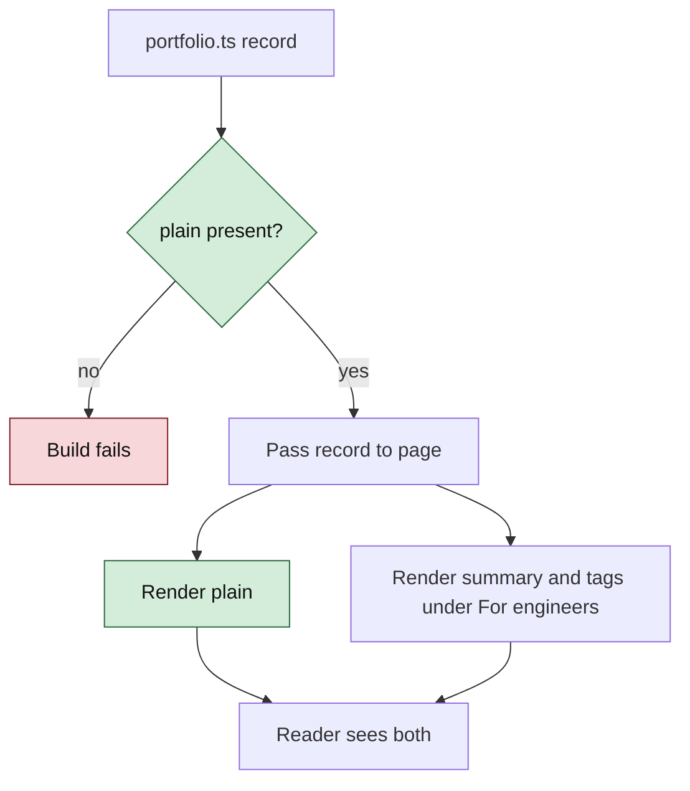

# Portfolio Content Contracts

These are local application contracts, not network APIs.

## Core types

> **Drift warning.** The types in this section describe the intended content model, not the shipped one. `src/data/portfolio.ts` implements a flatter `WorkItem` (string-literal categories, no `role`/`period`/`outcomes`/`evidence`), a three-kind `PublicationItem` without slugs or tags, and an `ActivityItem` without `id` or `category`. Reconciling the two means deciding whether to grow the code or shrink the contract, which is out of scope for the contact change. Read the code as authoritative until then.

```ts
type PublicationKind =
  | 'writing'
  | 'note'
  | 'research'
  | 'reproduction'
  | 'paper';

type PublicationStatus =
  | 'draft'
  | 'published'
  | 'submitted'
  | 'under-review'
  | 'accepted';

interface EvidenceLink {
  label: string;
  url: string;
  kind: 'github' | 'demo' | 'paper' | 'dataset' | 'slides' | 'external';
}

interface WorkItem {
  slug: string;
  title: string;
  category: 'production-ai' | 'ai-systems' | 'industrial-ai' | 'data-systems';
  summary: string;
  role: string;
  period: string;
  featured: boolean;
  tags: string[];
  outcomes: string[];
  evidence: EvidenceLink[];
  confidentialityNote?: string;
}

interface PublicationItem {
  slug: string;
  title: string;
  kind: PublicationKind;
  status: PublicationStatus;
  summary: string;
  publishedAt?: string; // ISO YYYY-MM-DD
  updatedAt?: string;   // ISO YYYY-MM-DD
  projectSlug?: string;
  tags: string[];
  evidence: EvidenceLink[];
}

interface ActivityItem {
  id: string;
  date: string; // ISO YYYY-MM-DD
  category: 'release' | 'writing' | 'research' | 'experiment' | 'milestone';
  title: string;
  summary: string;
  url?: string;
  projectSlug?: string;
}

type EmploymentType = 'full-time' | 'contract' | 'part-time' | 'internship';

interface ExperienceItem {
  id: string;
  company: string;
  title: string;
  employmentType: EmploymentType;
  location: string;
  workMode?: 'on-site' | 'hybrid' | 'remote';
  startDate: string; // ISO YYYY-MM
  endDate?: string;  // ISO YYYY-MM; absent means Present
  current?: boolean;
  summary: string;
  highlights: string[];
  skills?: string[];
  source: 'linkedin-screenshot' | 'approved-resume' | 'both';
}

interface ResumeAsset {
  label: 'Download resume';
  href: string;
  filename: string;
  updatedAt: string; // ISO YYYY-MM-DD
}
```

## Route contracts

Routes registered in `src/App.tsx` today:

```text
/#/                         Homepage
/#/work                     Work collection
/#/experience               Complete professional chronology
/#/writing                  Writing and build logs
/#/research                 Research collection
/#/notes                    Notes collection
/#/resume                   Résumé viewer
/#/*                        Not found
```

Registered (ADR-023, shipped 2026-09-23):

```text
/#/work/:slug               Case study. Resolves only when the WorkItem has `caseStudy`.
/#/writing/:slug            Post. Resolves only when status is Published (any status in `vite dev`).
```

Detail routes (`/#/research/:slug`, `/#/notes/:slug`) remain unbuilt. `/#/work/:slug` and `/#/writing/:slug` are proposed above. Earlier versions of this file listed all four as though they existed. They did not. Any link written against them resolves to the not-found route. They remain the intended Phase 2 design and will be restored to this table when they are actually registered.

The homepage contact section is a scroll target within `/#/`, not a route. See ADR-012.

### Not-found contract

- Renders inside `PortfolioShell`, inheriting the site palette and navigation.
- Recovery link uses `react-router` `Link`, never a raw `href`, so it resolves under the deployed base path.
- Logs the attempted pathname once per navigation.

## Contact contract

```ts
interface ContactChannel {
  label: string;
  value: string;              // shown verbatim as page text
  href: string;               // mailto:, https:, or base-composed asset path
  copyable?: boolean;         // renders a clipboard control beside the value
}
```

Required behavior:

- `value` is rendered as readable text for every channel. It is never replaced by an icon, hidden behind an interaction, or obfuscated.
- The email channel sets `copyable`. Its copy control writes `value` — not `href` — to the clipboard.
- A resolved clipboard write shows a transient confirmation that reverts after roughly two seconds. The pending timer is cleared on unmount.
- A rejected clipboard write surfaces the failure. It is never swallowed, because a silent failure is indistinguishable from success.
- `mailto:` and clipboard are both permitted to fail without degrading the section: the visible `value` is the guaranteed path.
- External `href` values are HTTPS and carry `rel="noreferrer"` with `target="_blank"`.
- The résumé `href` is composed from `import.meta.env.BASE_URL`.

## Document asset contracts

Static metadata in `index.html`, all of which must survive being served from a subpath:

```text
link rel="icon"     base-path-composed, resolves to public/favicon.ico
og:image            absolute deployed URL to the social card
og:url              absolute deployed URL to the site root
twitter:card        summary_large_image, valid only while og:image exists
```

Required behavior:

- No URL pointing back at this site is written as a raw absolute path. It is either router-managed or composed from the Vite base.
- `twitter:card` may declare `summary_large_image` only while a reachable `og:image` exists; otherwise shares render an empty card.
- `og:url` is hardcoded to the deployed origin and must be edited if the deployment target changes.

## Homepage query contracts

```ts
getFeaturedWork(limit = 3): WorkItem[]
getRecentPublications(limit = 3): PublicationItem[]
getRecentActivity(limit = 5): ActivityItem[]
getRelatedPublications(slug: string, limit = 3): PublicationItem[]
getExperience(): ExperienceItem[]
getResumeAsset(): ResumeAsset
```

Required behavior:

- Results are deterministic.
- Date-sorted queries use descending ISO dates.
- Draft publications never appear in public recent-publication results.
- Featured work is capped at three on the homepage.
- Unknown slugs return the not-found route.
- Experience records sort by `startDate` descending and use stable IDs.
- `experiences` holds every role (J&J, iDwTeam, HP, ASU, ECrent). `resumeExperiences` filters out `linkedinOnly` records and feeds the home strip and main timeline (J&J → HP → ECrent). The "Full history" list renders all of `experiences` as one-line rows.

## Long-form content contract (ADR-023, shipped 2026-09-23)

Additions to the shipped types in `src/data/portfolio.ts`. Existing fields are unchanged.

```ts
interface WorkItem {
  // ...existing fields
  caseStudy?: string;          // slug of src/content/<slug>.md; presence enables /#/work/:slug
}

interface PublicationItem {
  // ...existing fields
  slug: string;                // unique across publications; names src/content/<slug>.md
  date?: string;               // ISO date, required when status is 'Published'
}

// src/pages/Article.tsx
loadBody(slug: string): Promise<string | null>   // raw Markdown, or null if no file matches
```

Invariants:

- Every `caseStudy` and every publication `slug` has a matching `src/content/<slug>.md`. A missing file renders NotFound and logs `console.error` in development.
- `marked` output is inserted with `dangerouslySetInnerHTML`. This is allowed only because every Markdown file is committed to this repo. Any external content source requires a sanitizer first (ADR-023).
- The nav includes Writing if and only if `publications.some((p) => p.status === 'Published')`.
- The `Article` chunk, including `marked`, is lazy, and each Markdown body is its own chunk. Neither `marked` nor article text may land in the entry bundle. Measured at ship: entry +0.3 kB gz (route definitions and card links), `Article` chunk 14.9 kB gz, each body ~2 kB gz. (Note: the entry bundle already exceeds its 65 kB budget at ~107.7 kB gz, because the cleanup in ADR-020 has not shipped. This change neither fixes nor worsens that.)
- Case-study text follows the confidentiality boundary in `architecture.md`. No internal system, team, or metric names. No numbers beyond the published résumé without Saketh's confirmation.

Error shape: there is no error UI beyond NotFound. A failed chunk load (e.g. network drop mid-navigation) also resolves to NotFound rather than a blank page.

## Content validation rules

- Every slug and activity ID is unique.
- Every public artifact has a title, summary, date, and honest type/status.
- `accepted` requires a public venue or evidence link.
- `submitted` and `under-review` must never be styled as accepted.
- Employer-confidential work cannot link to private material or disclose restricted implementation details.
- External URLs use HTTPS except local development URLs.
- Activity events describe an outcome, not a number of commits.
- Every experience record requires title, organization, employment type, start/end dates, location, and source provenance.
- Internship records require the same evidence and are not inferred from education or project work.
- Resume href resolves under the deployed Vite base path and the asset is a readable PDF.

## Future optional build input

If GitHub-assisted activity is added, its adapter may accept:

```ts
interface GitHubReleaseInput {
  repository: string;
  tag: string;
  name: string;
  publishedAt: string;
  url: string;
  description?: string;
}
```

The adapter output remains a draft `ActivityItem`; it must not bypass review and publish directly.

## Visual upgrade contracts (proposed 2026-09-22)

### Site constants

Removes the duplicated URL literals. It is the single source for every outbound link the shell, hero, and contact section render.

```ts
// src/data/site.ts
export const site = {
  name: 'Saketh Velidimalla',
  role: 'Applied AI Systems Engineer',
  email: 'sakethv7@gmail.com',
  github: 'https://github.com/Sakethv7',
  linkedin: 'https://www.linkedin.com/in/sakethvelidimalla/',
  resume: {
    href: `${import.meta.env.BASE_URL}Saketh_Velidimalla_Resume.pdf`,
    filename: 'Saketh_Velidimalla_Resume.pdf',
  },
} as const;
```

Invariants: `resume.href` is composed from `BASE_URL` (ADR-014). External URLs are HTTPS. No component builds these strings itself.

### BentoTile

```ts
type TileVariant = 'identity' | 'now' | 'metric' | 'flagship' | 'project' | 'thesis' | 'experience' | 'resume';

interface BentoTileProps {
  variant: TileVariant;        // selects grid-area and variant styling
  as?: 'article' | 'section' | 'div';   // default 'article'; identity uses 'section' containing the page h1
  labelledBy?: string;         // id of the tile's heading, for aria-labelledby
  children: React.ReactNode;
}
```

Renders `<{as} class="bento-tile" data-tile={variant} aria-labelledby={labelledBy}>`, with a decorative `::before` spotlight layer.

Invariants:

- Exactly one `h1` exists on the page, inside the `identity` tile.
- Tile headings are `h2` (grid-level) or `h3`. No heading levels are skipped.
- The whole tile is not a link. Links inside tiles are ordinary anchors, so a tile with two links (repo and case study) stays unambiguous to screen readers.
- `variant` maps 1:1 to a `grid-area` name. Adding a variant means adding an area at all three breakpoints.

### useSpotlight

```ts
function useSpotlight<T extends HTMLElement>(): React.RefObject<T>;
```

Attach the returned ref to the grid container.

Behavior contract:

- Registers one `pointermove` listener on the container. It never adds a per-tile listener.
- On move, it finds `event.target.closest('[data-tile]')` and sets `--mx` and `--my` on that element, in pixels relative to its bounding box.
- It does nothing when `matchMedia('(hover: none)')` matches.
- It removes the listener on unmount.
- It never calls React `setState`. Pointer movement must not re-render.

### Design tokens

```css
/* src/styles/tokens.css — ratio ≈ 1.25, base 1rem */
:root {
  --step--2: 0.75rem;                          /* eyebrow, meta, tags */
  --step--1: 0.875rem;                         /* secondary body — floor for readable text */
  --step-0:  1rem;                             /* body */
  --step-1:  1.25rem;                          /* h3, tile titles */
  --step-2:  1.5625rem;                        /* large tile titles */
  --step-3:  clamp(1.75rem, 1.2rem + 2.2vw, 2.5rem);   /* h2 small */
  --step-4:  clamp(2.25rem, 1.4rem + 3.6vw, 3.75rem);  /* h2 */
  --step-5:  clamp(3rem, 1.6rem + 6vw, 6rem);          /* h1 */

  --space-1: 4px;  --space-2: 8px;  --space-3: 12px; --space-4: 16px;
  --space-5: 24px; --space-6: 32px; --space-7: 48px; --space-8: 64px;
  --space-9: 96px; --space-10: 128px;

  --radius-tile: 14px;
  --tile-row: 168px;
  --grid-gap: var(--space-4);

  --ease-out: cubic-bezier(.22, 1, .36, 1);
  --dur-fast: 160ms; --dur-base: 240ms; --dur-enter: 480ms;

  --font-display: 'Newsreader', Georgia, serif;   /* pending typeface decision */
  --font-body: Inter, ui-sans-serif, system-ui, sans-serif;
  --font-mono: ui-monospace, 'SF Mono', Menlo, monospace;
}
```

Invariants:

- No `font-size` below `--step--2`. Running text is never below `--step--1`.
- Negative letter-spacing applies only at `--step-3` and above. At small sizes, tight tracking hurts legibility.
- Every `margin`, `padding`, and `gap` in `index.css` uses a `--space-*` token. Exceptions are 1px borders and optical nudges ≤ 3px.

### Motion contract

| Selector / attribute | Effect | Reduced motion |
|---|---|---|
| `.enter` + `style="--i:n"` | stagger entrance, delay `n × 60ms` | none, final state |
| `.reveal` | scroll-linked fade/rise, only inside `@supports (animation-timeline: view())` | none |
| `.bento-tile::before` | spotlight at `--mx/--my` | still shown (not motion; follows pointer) |
| `a:has(> svg.lucide-arrow-right):hover svg` | `translateX(3px)` | none |
| `[data-tile="now"] .live-dot::after` | opacity/scale pulse, infinite | static dot |

### Performance budget contract

Checked after `vite build`, against the gzip column:

- `assets/index-*.js` ≤ 65 kB
- `assets/index-*.css` ≤ 8 kB
- At most 2 web-font families, and every family loaded is referenced by a token.
- 0 infinite animations on paint-triggering properties.

A change that breaks the budget either updates this table with its reasoning in an ADR, or doesn't ship.

### Résumé route (proposed, ADR-021)

```text
/#/resume        Résumé viewer — inside PortfolioShell, lazy-loaded chunk
```

- Embeds the résumé URL (composed from `BASE_URL`) via `<object data type="application/pdf">`. The fallback children are an "Open PDF" and a "Download" link, so a blocked embed never renders blank.
- Below 768px it does not render the `<object>`; it renders the fallback card only.
- The header's `Download résumé` link stays a direct download. "Résumé" is not added to the primary nav (ADR-012's slot argument applies). The route is reached from the hero, the Experience CTA, and the contact section via a "View résumé" link.

## Plain-language contracts (proposed 2026-10-05, ADR-025 to ADR-028)

### Visual Level



*Caption: green is new. The record must hold a `plain` string or the build fails (red). Both texts then render, in order.*

Contracts below are written against the **shipped** types in `src/data/portfolio.ts`, not the intended model in "Core types" above. See the drift warning there.

### Type change

```ts
interface WorkItem {
  // ...existing fields
  plain: string;   // required. One sentence for a non-technical reader.
}

interface PublicationItem {
  // ...existing fields
  plain: string;   // required. Same rule.
}
```

`summary` and `tags` keep their meaning. `summary` is now the technical description, for engineers.

### Content rules for `plain`

| Rule | Check |
|---|---|
| One sentence, 25 words or fewer | Review, `ste-lint` |
| No technology list, no acronym a layperson would not know | Review |
| No semicolons, no em-dash chains | `ste-lint` |
| No internal system, team, or metric name | Review (confidentiality boundary in `architecture.md`) |
| A number or outcome only if on the résumé or confirmed by Saketh | Review |
| Not an empty string | Review. Not enforced by the type. |

### Rendering contract

Every surface that shows an item renders in this order: `plain`, then a label with the exact text `For engineers`, then `summary`, then (for cards and rows) `tags`, then links.

| Surface | Reads | Class names |
|---|---|---|
| Home featured card | `WorkItem.plain`, `.summary`, `.tags` | `.plain-line`, `.for-engineers` |
| Work archive row | same | same |
| Writing list row | `PublicationItem.plain`, `.summary` | same |
| Article header | record `plain` and `summary` | `.plain-line` (lead), `.for-engineers` |

`findRecord` in `Article.tsx` returns `plain` alongside `title`, `eyebrow`, and `summary`. It returns the same field for both collections.

Both texts are always in the DOM and always visible. Nothing is collapsed, so screen readers and print see both. The label is a visible text element, not a tooltip.

### Meta tags

`index.html` `description` and `og:description` use plain words and no mention of industrial machines or edge compute (ADR-027). Both are 160 characters or fewer. Per-article previews remain impossible under HashRouter (see architecture open questions), so the home page's tags carry every shared link.

### Invariants

- Every `WorkItem` and every `PublicationItem` has a non-empty `plain`. The type enforces presence only.
- `plain` and `summary` describe the same thing at two levels. If one changes meaning, the other changes in the same edit.
- No new route, dependency, or fetch. The bundle budget in the performance contract is unchanged. The added cost is about 37 short strings and a few CSS rules.
- Article Markdown bodies are not modified, except one "In one paragraph" quote at the top of `enterprise-ai-quality.md`.
- `plain` follows the confidentiality boundary in `architecture.md`. It adds no numbers beyond the published résumé.

### Error shape

A missing `plain` is a TypeScript compile error, for example `Property 'plain' is missing in type`. There is no runtime error and no error UI.

### Validation additions

Append to "Content validation rules":

- Every work item and publication has a `plain` sentence of 25 words or fewer.
- `og:description` and `description` match the hero's plain claim.
- The hero, `description`, `og:description`, and contact intro do not mention industrial machines or edge compute. The agentic-maintenance Work row and build log may.
