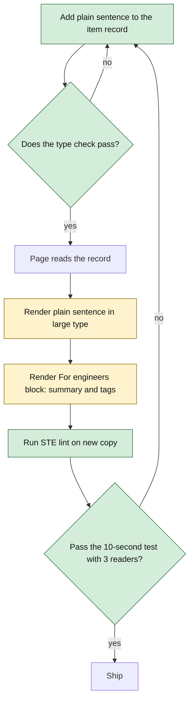

# Portfolio Logic Flow

## Visitor flow

```text
Visitor arrives
    │
    ├── understands role and thesis
    │
    ├── chooses strongest evidence
    │      ├── production system
    │      ├── independent system
    │      └── industrial / compute direction
    │
    ├── checks recent public output
    │      ├── writing
    │      ├── research
    │      └── notes
    │
    ├── scans experience preview
    │      ├── opens complete chronology
    │      └── downloads recruiter resume
    └── reaches the contact section
           ├── reads the address
           ├── copies the address
           ├── opens a mail client
           └── opens GitHub or LinkedIn
```

## Contact flow

The controlling property is that no step depends on the one before it. A visitor who reads the section and does nothing else still leaves with the address.

```text
Contact section renders
        │
        ├── address is on screen as text ──────────── terminal success
        │
        ├── visitor clicks the address
        │        └── mailto: handed to the OS
        │                 ├── handler registered ──> compose window
        │                 └── no handler ─────────> nothing happens,
        │                                            address still on screen
        │
        └── visitor clicks copy
                 ├── clipboard write resolves ─────> confirm for ~2s, then reset
                 └── clipboard write rejects ─────> report the failure,
                                                     address still on screen
```

*The `mailto:` and the clipboard are both allowed to fail. The visible address is what makes that acceptable.*

Rules:

1. The address is never hidden behind a click, a hover, or an obfuscation scheme.
2. The copy control reports its result. A silent copy is indistinguishable from a failed one.
3. Copy confirmation is transient state that resets on a timer; leaving a component unmounted mid-timer must not warn.
4. The clipboard write can reject — denied permission, insecure context — and that rejection is surfaced, not swallowed.
5. The section is reachable by keyboard in reading order, and the copy control is a real button with an accessible name.

## Not-found flow

```text
Unknown hash route
        │
        ├── log the attempted path
        ├── render inside PortfolioShell
        │        └── site navigation stays available
        └── offer router navigation home
                 └── never a raw href="/", which
                     leaves the project subpath
```

Rules:

1. The page inherits the site's dark palette. A light-background page inside a dark site reads as a crash, not as a 404.
2. Recovery uses `Link`, so it resolves under the deployed base path.
3. The shell stays rendered, so a visitor who lands here from a stale link can reach any section without going back.

## Homepage selection logic

1. Load all content from the local registries.
2. Select work records with `featured: true`.
3. Enforce a maximum of three featured work records.
4. Combine public writing, research, and notes.
5. Sort by `publishedAt` descending and show the latest three.
6. Sort activity records by `date` descending and show the latest five.
7. Render an honest empty state when no research artifact exists; do not manufacture placeholders that look published.

## Detail-page flow

> **Shipped 2026-09-23 (ADR-023).** The first version ships steps 1–4 and 6. Step 5, related artifacts, waits until there are enough pages to relate.

1. Read the route collection (`work` or `writing`) and the `:slug` from the URL.
2. Find the matching record in `portfolio.ts`. For `work`, the record must have a `caseStudy` file. For `writing`, its status must be `Published` in production builds. In `vite dev`, planned posts are reachable too, so drafts can be previewed before they go live.
3. Render title, kind, date, summary, and evidence links from the record.
4. Load the Markdown body for that slug (its own chunk), convert it with `marked`, and render it inside the article layout. While it loads, show the header with an empty body, not a spinner, so the page doesn't jump.
5. Show related artifacts sharing tags or project identifiers. *(Deferred.)*
6. Return the real not-found page when no record matches, the record fails step 2, or the Markdown file is missing. A missing file is a build mistake, so it also logs a console error in development.

State for one visit:

```text
route matched ──► record found? ──no──► NotFound
                      │ yes
                      ▼
              header rendered, body empty
                      │ Markdown chunk loads
                      ├── ok ─────► body rendered
                      └── fails ──► NotFound (dev: console.error)
```

*Caption: the only failure a visitor can see is the not-found page. There is no half-rendered article state.*

## Experience flow

```text
Open Experience
      │
      ├── load validated records
      ├── sort by start date descending
      ├── render semantic role cards
      └── connect cards as a neural path
                │
                ├── motion allowed → signal activates nodes in order
                └── reduced motion → static connected nodes

Recruiter may then
      ├── open/download resume
      ├── open LinkedIn
      └── inspect selected work evidence
```

Rules:

1. Present precedes past roles.
2. Employment type is visible so contract, full-time, and part-time work are not conflated.
3. The animation never hides content or controls reading order.
4. No internship is published until its title, organization, dates, and source evidence are supplied or found in an approved artifact.

## Publishing flow

```text
Create artifact
    │
    ├── classify it honestly
    │      ├── note
    │      ├── writing
    │      ├── research / reproduction
    │      └── paper
    │
    ├── add metadata record
    ├── add body / evidence links
    ├── validate required fields and unique slug
    ├── preview desktop and mobile
    └── publish site
```

Concrete steps for a post, once ADR-023 ships:

1. Write `src/content/<slug>.md`.
2. Add a `publications` record with `slug`, `date`, `summary`, and status `Planned` while drafting.
3. Preview it locally at `/#/writing/<slug>`; planned posts are reachable in development only.
4. Flip status to `Published` and push to main. The Writing tab reappears in the nav automatically, because the nav shows it only when a published post exists.
5. Share the canonical URL in a LinkedIn post (ADR-024).

## Activity ingestion flow

### Initial manual flow

1. Finish a meaningful public artifact or milestone.
2. Add an activity record with a date, category, plain-language change, and evidence URL.
3. Validate that the event is not merely a commit-count signal.
4. Publish it in chronological order.

### Possible later GitHub-assisted flow

1. Fetch releases or explicitly labeled repository events at build time.
2. Normalize them into draft activity records.
3. Require human selection and copy editing.
4. Publish only approved records.

## Content replacement rule

When adding something to the homepage:

1. Identify which existing item it replaces or deepens.
2. If it is not stronger or more current, keep it on its collection/detail page.
3. Never expand the homepage simply because another credential or project exists.

## Visual upgrade flows (proposed 2026-09-22)

### Bento layout resolution

Layout is decided entirely by CSS at each breakpoint. No JavaScript measures anything, so there is no layout shift after hydration.

```text
Viewport width
      │
      ├── ≥ 1024px ──> 4-col grid, named areas place tiles (see architecture.md)
      ├── 640–1023px ─> 2-col grid, identity + flagship span both columns
      └── < 640px ───> 1-col flow, tiles in DOM order
                             │
                             └── DOM order == reading order == tab order
                                 (identity → now → metric → flagship → wiki
                                  → roastrank → thesis → experience → résumé)
```

*Visual placement changes by breakpoint; reading order never does.*

Rules:

1. No tile is hidden at any breakpoint. If something doesn't fit on mobile, it wasn't needed on desktop either.
2. Tile row height is a token (`--tile-row`), not content-driven, on desktop only. Below 1024px, rows size to content, so long copy never clips.
3. Tile content comes from `src/data/*`. A tile whose record is missing renders nothing. It never shows a placeholder.

### Motion lifecycle

```text
Page load
   │
   ├── prefers-reduced-motion: reduce ?
   │        └── yes ──> all elements render in final state; stop
   │
   ├── Hero stagger (CSS only, runs once)
   │        eyebrow (0ms) → h1 (60) → thesis (120) → CTAs (180) → tiles (240 + 40·i)
   │        each: opacity 0→1, translateY 12px→0, 480ms, ease-out
   │
   ├── Scroll reveal (below-fold sections)
   │        @supports (animation-timeline: view()) ?
   │           ├── yes ──> fade/rise tied to scroll position, entry 0%–cover 25%
   │           └── no ───> visible immediately (no JS fallback, by design)
   │
   └── Pointer enters bento grid  [@media (hover: hover) only]
            │
            ├── pointermove (delegated, one listener on grid)
            │      └── find closest [data-tile] → set --mx, --my on it
            ├── CSS paints radial-gradient at (--mx, --my) on ::before
            └── pointerleave ──> ::before opacity → 0 (200ms)
```

*Every branch ends with all content visible. Motion only decides how it arrives.*

Rules:

1. No content starts invisible without a guaranteed path to visible. The hero stagger uses `animation-fill-mode: both` with a finite duration. Scroll reveal exists only inside `@supports`, so unsupported browsers never see the hidden starting state.
2. Only `opacity` and `transform` animate, except the spotlight gradient (see ADR-019).
3. No animation loops forever except the NOW tile's live dot, which animates only `opacity`/`transform`.
4. Programmatic scrolling (the hero's Contact link) reads `prefers-reduced-motion` and uses `behavior: 'auto'` when set. This fixes the current bug, where `'smooth'` is hardcoded.
5. Hover effects never move text. Borders, glows, and icons may move; paragraphs may not.

### Focus flow

```text
Keyboard user presses Tab
      │
      └── :focus-visible element
             ├── 2px outline, --accent color, 3px offset
             └── if inside a bento tile ──> tile gets :focus-within border state
                                             (same visual as hover, minus spotlight)
```

Rule: every hover affordance has a focus equivalent, except the pointer-positional spotlight, which has no keyboard meaning.

### Upgrade delivery sequence

```text
Phase 0  cleanup      remove providers, dead modules, unused font  → verify: budget table, all routes render
Phase 1  tokens       tokens.css, index.css onto tokens            → verify: visual diff per route, no overflow at 375/768/1280
Phase 2  bento        site.ts, BentoTile, BentoHero, Index         → verify: DOM order, tab order, 3 breakpoints, a11y tree
Phase 3  motion       stagger, reveal, spotlight, focus, fixes     → verify: reduced-motion emulation, Performance panel shows no paint loops
```

Each phase is one commit, reviewable and revertible on its own.

## Plain-language layer flows (proposed 2026-10-05)

### Visual Level



*Caption: green is new (the required field, the lint, the human test). Amber is changed (rendering order). Both failure paths loop back to the copy, because every failure here is a wording problem.*

### Render flow for one card, row, or header

1. The page selects its records (featured items, all work items, published notes, or one article).
2. For each record, render the `plain` field as the main paragraph.
3. Render a small "For engineers" label.
4. Under it, render the existing `summary`. Cards and rows also render `tags` here.
5. Render the existing links (repository, demo, case study) unchanged.

An article header follows the same order, then the Markdown body loads as before (see Detail-page flow).

### Failure behavior

| Failure | What happens | Who notices |
|---|---|---|
| Item has no `plain` | The type check fails. The build fails. Nothing ships. | The author, at build time |
| `plain` is empty string | Type check passes. The card shows an empty paragraph. | The author, in review. The validation rule in `api.md` lists it. |
| `plain` is over 25 words | Nothing automatic. `ste-lint` and review flag it. | Reviewer |
| `plain` and `summary` disagree | Nothing automatic. | Reviewer, in the same edit, since both live in one record |
| Hero test fails | Rewrite the hero and featured sentences. Test again with 3 new people. | The tester |

There are no retries and no runtime states. The site is static. Every failure is caught at build time or in review.

### State transitions

None at runtime. The change adds no client state. The only sequence is the authoring loop in the chart above.

### Delivery order

```text
1  api.md types + data      add plain to both types; write 37 sentences   → verify: tsc passes
2  UI                       cards, rows, article header, hero, meta tags   → verify: all 6 routes render, no overflow at 375/768/1280
3  case study intro         "In one paragraph" quote                       → verify: no internal names, no unconfirmed numbers
4  acceptance               ste-lint, then the 10-second test              → verify: 2 of 3 pass
```

Each step is one commit.

## Proposed evidence and conversion flow

```text
Homepage visitor
  -> reads systems thesis
  -> opens one of three distinct public systems
       -> sees scope, technical focus, and evidence status
  -> opens Experience for enterprise work
       -> reads a bounded system diagram and role evidence
  -> chooses résumé, GitHub, LinkedIn, or email
```

Rules: cards lead with a real system constraint and user outcome; diagrams explain actual data or control flow; enterprise content distinguishes confirmed work from generalized explanation; and the next visitor action is visible without inference.
